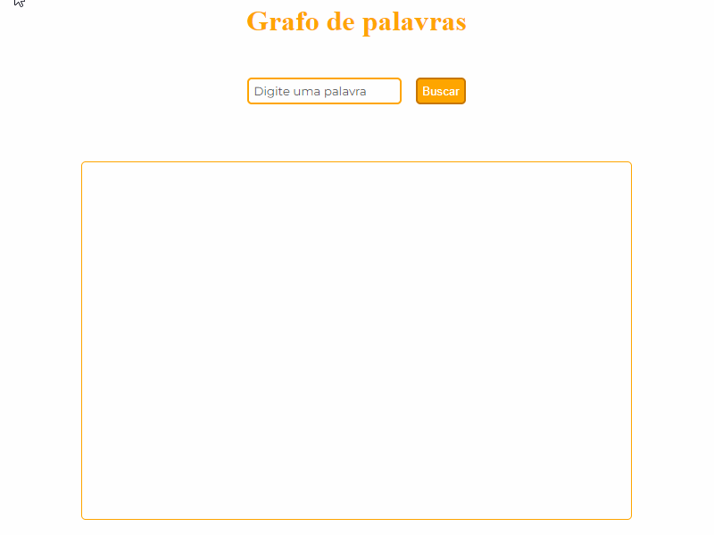
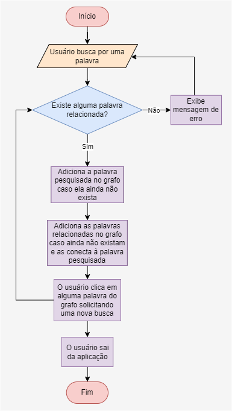

# Grafo de palavras relacionadas

Este é um projeto de uma aplicação WEB que consiste em construir um grafo de palavras relacionadas baseadas em uma palavra pesquisada pelo usuário. Um grafo é uma estrutura de dados capaz de representar **relacionamentos** entre diversas entidades.

Link da aplicação [https://palavras-relacionadas.vercel.app](https://palavras-relacionadas.vercel.app)

# Tecnologias, frameworks e bibliotecas utilizadas

## Javascript

A linguagem nativa da WEB

## React

Uma das bibliotecas mais utilizadas para desenvolver aplicações WEB modernas

## Next.js

O framework mais utilizado para desenvolver aplicações WEB com o React

## Vercel

Plataforma de hosting/deploy de aplicações WEB modernas (especialmente para o Next.js)

## Axios

Biblioteca para efetuar requisições HTTP

## Cheerio

Biblioteca para fazer scrapping. Ela foi utilizada para encontrar as palavras relacionadas através do site [dicionariocriativo.com.br](dicionariocriativo.com.br).

## Cytoscape

Biblioteca para renderização de gráficos interativos

# Fluxograma da solução

# Escolhas para resolver o problema de busca das palavras relacionadas

Como eu nunca tive contato com esse tipo de problema antes, eu precisei pesquisar no Google sobre como obter as palavras relacionadas e descobri que existe um conjunto de técnicas chamadas _scrapping_ e _crawling_ que consistem em extrair dados de uma página web. Pesquisando sobre bibliotecas que implementam essas técnicas em javascript, encontrei a `puppeteer`, porém, ao efetuar o deploy a biblioteca estava dando problemas. Daí, tive que substituí-la pela `cheerio` que alem de corrigir o erro, otimizou o tempo de extração das palavras relacionadas. Para fazer a extração, o `cheerio` foi configurado para processar o seletor CSS `.resumoBoxContent .tags a`, o qual referencia a parte da página do [dicionariocriativo.com.br](dicionariocriativo.com.br) que contem as palavras relacionadas.

# Escolhas para resolver o problema da exibição dos resultados

Novamente, como nunca tive contato prévio com grafos, minha primeira tentativa foi simplemsmente exibir as palavras relacionadas em forma de tags `li` em que o usuário poderia interagir com elas para efetuar uma nova busca.
Após estudar um pouco sobre o conceito de grafos e entender melhor como eles funcionam, pesquisei sobre bibliotecas javascript capazes de renderizar grafos no HTML e encontrei o `vis.js`, porém ele não estava funcionando bem com o React + Next.js. Daí, tive que substituí-lo pelo `cytoscape`, o qual funcionou perfeitamente. Precisei pedir ajuda à algumas pessoas para montar o grafo com as bibliotecas mencionadas anteriormente pois tive bastante dificuldade por nunca ter feito isso antes.

# Por que utilizar o React e o Next.js?

1. Estou estudando sobre React e quis me desafiar a implementar a solução com ele
2. Ouvi falar bastante sobre o `Next.js` e que grandes empresas as utilizam extensivamente. Sendo assim, gostaria de colocar um novo projeto no meu portifólio utilizando essa ferramenta
3. Ganhar mais destreza nessas tecnologias modernas

# Aprendizados

1. Aprendi o que é um grafo e pra que ele é utilizado.
2. Conheci a ferramenta Next.js e realizei uma API por ela.
3. Conheci a platafroma da Vercel e a fazer o deploy de aplicações.
4. Aprendi a usar o axios para fazer requisições HTTP.
5. Aprendi que existem diversos verbos HTTP e o objetivo dos principais (GET, POST, DELETE)
6. Aprendi utilizar o hooks `useState` e `useEffect` do React

# Propostas de melhorias

- Adicionar um botão para o usuário ativar o dark mode para minimizar o cansaço visual ao utilizar a aplicação
